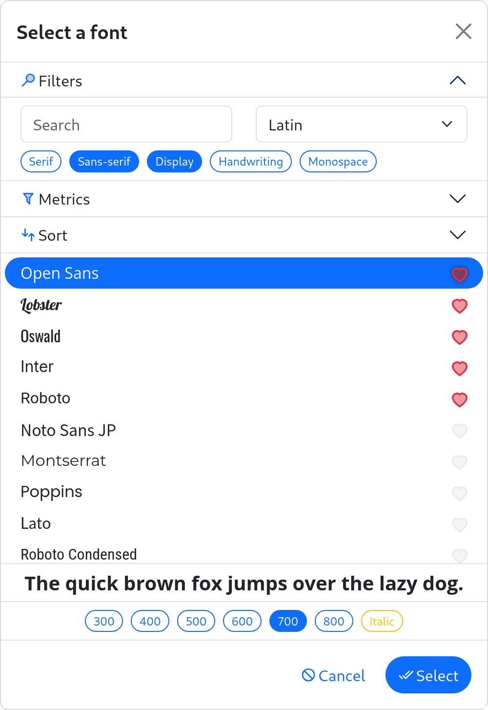
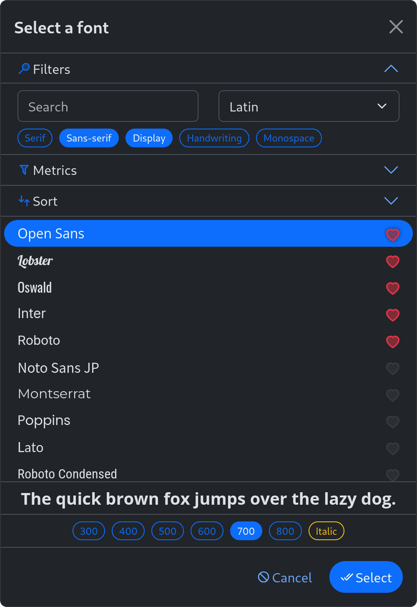

# Javascript Font Picker

An open source, free (as in beer), versatile, flexible and lightweight Javascript Font Picker Component for System fonts, Google fonts and custom (woff/ttf) fonts. Features dynamic font loading, favourites, keyboard navigation, fuzzy search, advanced metrics filters, property sorting and much more. Available in multiple languages.

## Please visit [jsfontpicker.com](https://www.jsfontpicker.com/) for a more detailed documentation and extensive demo's.<br><br>

## Table of Contents

- [Javascript Font Picker](#javascript-font-picker)
  - [Table of Contents](#table-of-contents)
  - [Features](#features)
  - [Live Demo](#live-demo)
  - [Screenshots](#screenshots)
  - [Installation](#installation)
    - [IIFE Bundle](#iife-bundle)
    - [ESM Bundle](#esm-bundle)
  - [Getting started](#getting-started)
    - [Create](#create)
    - [Configure](#configure)
    - [Interact](#interact)
  - [Documentation](#documentation)
  - [Developing](#developing)

## Features

- ❤️ Favourites
- ⌨️ Keyboard shortcuts
- ⚡ Dynamic font loading
- 🔤 Custom font support
- 🔎 Fuzzy search
- 📐 Advanced metrics filters
- 📶 Property sorting
- 🇳🇱 Translations for English, Dutch, German, Spanish and French
- 💪 No JQuery, just pure ES6

## [Live Demo](https://jsfontpicker.com)

👆 Try it out now!

## Screenshots

|            |                         Light                          |                         Dark                          |
| :--------- | :----------------------------------------------------: | :---------------------------------------------------: |
| **Button** |  |  |
| **Dialog** |  |  |

## Installation

The FontPicker requires a small stylesheet.
Please include the it like this:

```html
<link rel="stylesheet" href="fontpicker.css" />
```

It is also **highly recommended** to include a preconnect to Google fonts:

```html
<link rel="preconnect" href="https://fonts.gstatic.com" />
<link rel="preconnect" href="https://fonts.gstatic.com" crossorigin="anonymous" />
```

Now, depending on your environment, choose one of the following:

- [IIFE Bundle](#iife-bundle) → When using vanilla JavaScript, without ES modules
- [ESM Bundle](#esm-bundle) → When using ES modules or a bundler

### IIFE Bundle

Please import the IIFE script using a `script` tag in your HTML:

```html
<script src="fontpicker.iife.js"></script>
```

This exposes `FontPicker` and `FontPicker.FontLoader` globally (on window).

### ESM Bundle

Please import the ESM bundle using the `import` directive in your script:

```js
import FontPicker from 'fontpicker.js'
```

This allows you to use `FontPicker` and `FontPicker.FontLoader` directly.

## Getting started

### Create

To create a font picker, first create a button or input element:

```html
<button id="picker"></button>
```

Next instantiate the FontPicker, passing the element and an (optional) configuration:

```js
const picker = new FontPicker('#picker', {
  language: 'en',
  font: 'Open Sans',
  defaultSubset: 'latin',
})
```

### Configure

The picker's configuration can be changed after initialization. This is done by calling `.configure({...})` on the element:

```js
picker.configure({
  language: 'nl',
})
```

### Interact

The picker's various methods and properties can also be accessed directly on the element:

```js
// Set the current font
picker.setFont('Roboto:800')

// Handle events
picker.on('pick', (font) => { ... })

// Open the FontPicker, which returns a promise!
const font = await picker.open()
```

## Documentation

For all methods and properties, please view the [documentation](DOCUMENTATION.md).

## Developing

To install dependencies:

```bash
bun|deno|npm|pnpm|yarn install
```

To run:

```bash
bun|deno|npm|pnpm|yarn run dev
```

## License

This component is released under the MIT license. It is simple and easy to understand and places almost no restrictions on what you can do with the code.
[More Information](http://en.wikipedia.org/wiki/MIT_License)

The development of this component was funded by [Zygomatic](https://www.zygomatic.nl/).
