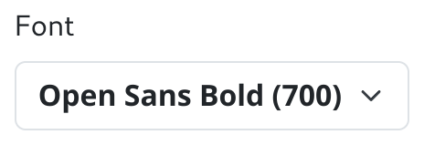

# Bootstrap Font Picker 2

A font picker supporting Google and system fonts, powered by Bootstrap.

## Table of Contents

- [Bootstrap Font Picker 2](#bootstrap-font-picker-2)
  - [Table of Contents](#table-of-contents)
  - [Features](#features)
  - [Screenshots](#screenshots)
  - [Installation](#installation)
    - [IIFE Bundle](#iife-bundle)
    - [ESM Bundle](#esm-bundle)
  - [Usage](#usage)
  - [Developing](#developing)

## Features

- dynamically loads fonts
- stores favourites and recents
- support for custom (local) fonts
- search, category and language filters
- translations for en, nl, de, es, fr
- no JQuery, pure ES6

## Screenshots




## Installation

Although the FontPicker is built on Bootstrap, it does require a tiny stylesheet.
Please include it like this:

```html
<link rel="stylesheet" href="fontpicker.css" />
```

It is also **highly recommended** to include a preconnect to Google fonts:

```html
<link rel="preconnect" href="https://fonts.gstatic.com" />
<link rel="preconnect" href="https://fonts.gstatic.com" crossorigin="anonymous" />
```

Now, depending on your implementation details, follow these instructions.

### IIFE Bundle

Please import the IIFE script using a `script` tag in your HTML:

```html
<script src="fontpicker.iife.js"></script>
```

The class can then be accessed with the `FontPicker` variable.

### ESM Bundle

Please import the ESM bundle using the `import` directive in your script:

```js
import { FontPicker } from 'fontpicker.js'
```

## Usage

To create a new FontPicker element, first create a button element.

```html
<button id="picker"></button>
```

The picker can then be created by instantiating the FontPicker class, and passing the button and an optional configuration:

```js
const button = document.querySelector('#picker')
const picker = new FontPicker(button, {
  language: 'en',
  font: 'Open Sans',
  defaultSubset: 'latin',
})
```

The picker's configuration can be changed after initialization. This is done by calling `.initialize({...})` on the element:

```js
picker.configure({
  language: 'nl',
})
```

The picker's various methods and properties can also be accessed directly on the element:

```js
// Set the current font
picker.setFont('Roboto:800')

// Handle events
picker.on('pick', (font) => { ... })

// Open the FontPicker, which returns a promise!
const font = await picker.open()
```

**For all methods and properties, please view the complete [documentation](DOCUMENTATION.md).**

## Developing

To install dependencies:

```bash
bun install
```

To run:

```bash
bun run dev
```
